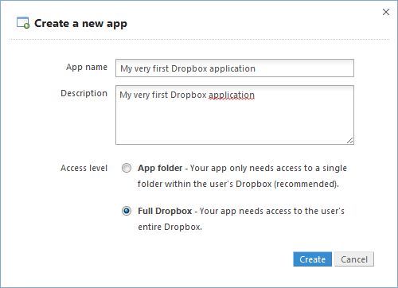
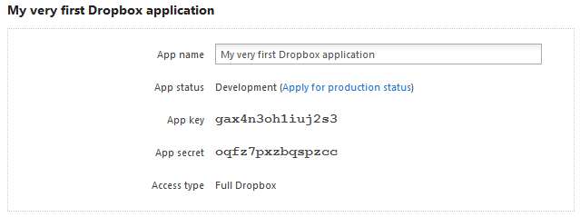
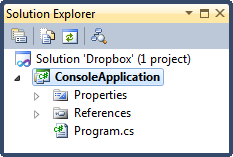
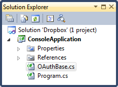
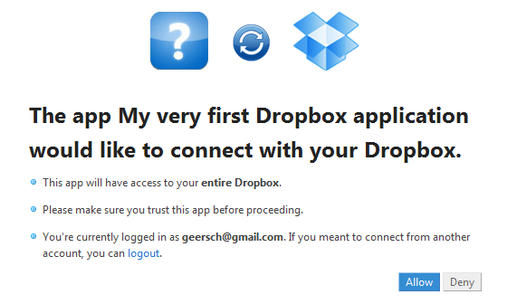
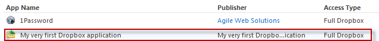

# Dropbox REST API Part 1: Authentication

## Introduction

I've been using Dropbox for about 6 months now. Before that I relied on Google Documents to share my files between the computers I use. Of course I had to login first and then I had to download them. Kind of a drag, certainly with big files.

With Dropbox that's a thing of the past. Just install the client software and it will synchronize all of your files automatically. They are neatly downloaded into a local Dropbox folder on each of your computers. And only the parts of the file that actually changed are transferred, greatly reducing the download time.

Another neat feature is that other applications can use your Dropbox folder to store their data. For instance, I use a password manager ([AgileBit's 1Password](https://agilebits.com/onepassword)) to securely save my login accounts. If I create a new account for a site on my laptop, then when I start my desktop it will automatically be known there once Dropbox has synched 1Password's files (which is nearly instantanously).

This is made possible thanks to the [Dropbox REST API](https://www.dropbox.com/developers/reference/api). Let's find out how we can use it...

## My Apps

Before you can start, you first need to register your application with Dropbox. To do so, please follow these steps:

- Login to Dropbox
- Click on the link "[Developers](https://www.dropbox.com/developers)" which is displayed on the bottom (center) of the page
- Click on the link "[My Apps](https://www.dropbox.com/developers/apps)" displayed in the menu on the left side
- Now click on the button "Create an App"


Choose a unique name for your application and select the appropriate access rights. You can lock your application in its own folder or you can grant it access to your entire Dropbox folder. Usually users don't want to grant third-party applications access to their entire Dropbox folder so it's best to choose the "App folder" option. However, since this is a demo I've choosen the "Full Dropbox" option. It will come in handy for later parts of this series.



Click Create to register your application. After you have created an application you'll get two tokens, namely an app key and a secret. Here are mine (don't worry...I've already deleted my app when you are reading this).



Keep those tokens nearby. You'll need them when signing in to Dropbox.

## Request Token

Dropbox offers several [SDKs](https://www.dropbox.com/developers/reference/sdk) for their REST API. Android, iOS, Java, Python and Ruby are all supported. Unfortunately there is no SDK for the .NET framework. Odd if you ask me, but not that big of an issue. There are some third party SDKs available, but let's do the basic plumbling ourselves. A bit more work to do, but we'll get there.

Before you can use the REST API you need to go through the authentication process. Dropbox requires that all requests are done over SSL and it uses [OAuth](http://oauth.net/) to authenticate all of the API requests.

After you have completed the authentication process you'll have an access token and access token secret. You can then use the access token for all the other requests. The authentication process consists out of three steps:

1. **Request token**: Obtain an OAuth request token to be used for the rest of the authentication process.
2. **Authorize**: The user must grant your application access to their Dropbox.
3. **Access token**: Once your application is authorized you can acquire an access token.

Let's start by obtaining an OAuth request token. Start Visual Studio 2010 and create a new blank solution called Dropbox. Next add a console application to the solution titled ConsoleApplication. Coming up with original names, it's important.



To quickly support OAuth I've downloaded a small, usefull library called [OAuth](http://code.google.com/p/oauth/). You can download it here:

[http://code.google.com/p/oauth/](http://code.google.com/p/oauth/)

Download the C# version, it's a single file (OAuthBase.cs) and add it to the console application project.



To request an OAuth request token you need to send a request to [https://api.dropbox.com/1/oauth/request_token](https://api.dropbox.com/1/oauth/request_token). You need to include the following parameters:

- **oauth_consumer_key**: Your API key
- **oauth_nonce**: A number used only once
- **oauth_timestamp**: Timestamp of the request
- **oauth_signature_method**: Signature method
- **oauth_signature**: Signature of the request. A hash to sign the request based on a couple of parameters.
- **oauth_version**: OAuth version used

There are no Dropbox specific parameters required for this request. Using the OAuth library you downloaded earlier this is pretty straightforward. First let's generate a signature for the request.

```csharp
var consumerKey = "your api key";
var consumerSecret = "your api secret";

var uri = new Uri("https://api.dropbox.com/1/oauth/request_token");

// Generate a signature
OAuthBase oAuth = new OAuthBase();
string nonce = oAuth.GenerateNonce();
string timeStamp = oAuth.GenerateTimeStamp();
string parameters;
string normalizedUrl;
string signature = oAuth.GenerateSignature(uri, consumerKey, consumerSecret,
    String.Empty, String.Empty, "GET", timeStamp, nonce, OAuthBase.SignatureTypes.HMACSHA1,
    out normalizedUrl, out parameters);

signature = HttpUtility.UrlEncode(signature);
```

You'll wind up with a weird looking string like zwct8VZ469%2bLpmi9C8%2fVpghpk7w%3d. Now let's issue the actual request.

```csharp
StringBuilder requestUri = new StringBuilder(uri.ToString());
requestUri.AppendFormat("?oauth_consumer_key={0}&", consumerKey);
requestUri.AppendFormat("oauth_nonce={0}&", nonce);
requestUri.AppendFormat("oauth_timestamp={0}&", timeStamp);
requestUri.AppendFormat("oauth_signature_method={0}&", "HMAC-SHA1");
requestUri.AppendFormat("oauth_version={0}&", "1.0");
requestUri.AppendFormat("oauth_signature={0}", signature);

var request = (HttpWebRequest) WebRequest.Create(new Uri(requestUri.ToString()));
request.Method = WebRequestMethods.Http.Get;

var response = request.GetResponse();
```

Here we compose the URL including all the parameters (query string) and then we issue the request. Your URL should resemble the following pattern:

```
https://api.dropbox.com/1/oauth/request_token?oauth_consumer_key=your api key&oauth_nonce=9328214&oauth_timestamp=1325081302&oauth_signature_method=HMAC-SHA1&oauth_version=1.0&oauth_signature=OskIFg2iOhcVJ2qHGDN6VDXxUik%3d
```

Just make sure to use your own API (or consumer) key and secret. Let's parse the response which includes a request token and request token secret. For instance:

**oauth_token_secret=bdifrgl4si3if8w&oauth_token=cny4z2vkqpbqd6k**

```csharp
var response = request.GetResponse();

var queryString = new StreamReader(response.GetResponseStream()).ReadToEnd();

var parts = queryString.Split('&');
var token = parts[1].Substring(parts[1].IndexOf('=') + 1);
var tokenSecret = parts[0].Substring(parts[0].IndexOf('=') + 1);
```

Voila, using this crude "Hello, World"-ish code you can now complete step 1 of the authentication process. You now have a token and token secret which you can use to complete the authentication process.

## Authorize

Once you have an OAuth request token and secret it's very simple to authorize your application. You only need to send a request to:

[https://www.dropbox.com/1/oauth/authorize](https://www.dropbox.com/1/oauth/authorize)

This request only requires one parameter, namely the request token you obtained earlier.

- **oauth_token**: the OAuth request token

Resulting in a URL which looks like this:

[https://www.dropbox.com/1/oauth/authorize?oauth_token=yourtoken](https://www.dropbox.com/1/oauth/authorize?oauth_token=yourtoken)

Let's start the authorization process:

```csharp
var queryString = String.Format("oauth_token={0}", token);
var authorizeUrl = "https://www.dropbox.com/1/oauth/authorize?" + queryString;
Process.Start(authorizeUrl);
```

This will open a new browser window. You'll be asked to login to Dropbox. Once you have done so you can choose if you want to grant (authorize) your first Dropbox application access to your Dropbox folder.



Once you click on Allow the application will be added to the list of applications which can access your Dropbox. You can view this list in the My Apps section in your account. You can always revoke the access at a later time.



## Access Token

By now you have an OAuth access token and you have authorized your application so that it can access your Dropbox folder. Time to finish the authentication process. After the authorization step is complete you can acquire an access token.

This access token is needed to authenticate all the API requests. Once you have obtained such a token you can store it and reuse it later. You don't need to go through the authentication process again. Just make sure to store the token securely, because it is required for all access to the user's Dropbox folder.

Acquiring an access token is very similar to the first step. You must send a request to [https://api.dropbox.com/1/oauth/access_token](https://api.dropbox.com/1/oauth/access_token), including the following parameters:

- **oauth_consumer_key**: Your API key
- **oauth_token**: The OAuth token you obtained in step 1
- **oauth_nonce**: A number used only once
- **oauth_timestamp**: Timestamp of the request
- **oauth_signature_method**: Signature method
- **oauth_signature**: Signature of the request. A hash to sign the request based on a couple of parameters.
- **oauth_version**: OAuth version used

First let's generate a signature for this request.

```csharp
var consumerKey = "your api key";
var uri = "https://api.dropbox.com/1/oauth/access_token";

OAuthBase oAuth = new OAuthBase();

var nonce = oAuth.GenerateNonce();
var timeStamp = oAuth.GenerateTimeStamp();
string parameters;
string normalizedUrl;
var signature = oAuth.GenerateSignature(new Uri(uri), consumerKey, consumerSecret,
    oauthToken.Token, oauthToken.Secret, "GET", timeStamp, nonce,
    OAuthBase.SignatureTypes.HMACSHA1, out normalizedUrl, out parameters);

signature = HttpUtility.UrlEncode(signature);
```

Now you can send the request.

```csharp
var requestUri = new StringBuilder(uri);
requestUri.AppendFormat("?oauth_consumer_key={0}&", consumerKey);
requestUri.AppendFormat("oauth_token={0}&", oauthToken.Token);
requestUri.AppendFormat("oauth_nonce={0}&", nonce);
requestUri.AppendFormat("oauth_timestamp={0}&", timeStamp);
requestUri.AppendFormat("oauth_signature_method={0}&", "HMAC-SHA1");
requestUri.AppendFormat("oauth_version={0}&", "1.0");
requestUri.AppendFormat("oauth_signature={0}", signature);

var request = (HttpWebRequest) WebRequest.Create(requestUri.ToString());
request.Method = WebRequestMethods.Http.Get;
```

Parsing the response will give you a return value which resembles this:

```sh
oauth_token_secret=95grkd9na7hm&oauth_token=ccl4li5n1q9b
```

```csharp
var response = request.GetResponse();
var reader = new StreamReader(response.GetResponseStream());
var accessToken = reader.ReadToEnd();

var parts = accessToken.Split('&');
var token = parts[1].Substring(parts[1].IndexOf('=') + 1);
var secret = parts[0].Substring(parts[0].IndexOf('=') + 1);
```

You now have an access token and corresponding access token secret. The authentication process is now complete and you can use the access token and secret to sign requests for the main API calls.

**Remark**: Make sure to leave some time between step 2 and 3, so that the authorization step can succeed. You need to redirect the user to Dropbox so that they can authorize your application. You need to wait until the user has completed this step.

In part 2 of this series I'll show you some examples of how you can use the acess token and secret to access the main Dropbox REST API.
