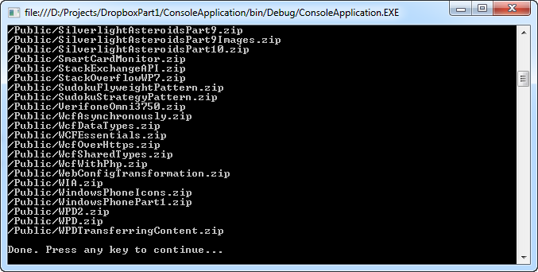

# Dropbox REST API Part 2: API Requests

## Introduction

In the previous article, [Dropbox REST API Part 1: Authentication](../part-1/README.md), I showed you how you can obtain an access token using the Dropbox REST API and [OAuth](http://oauth.net/).

Once you have an access token, you can use it to access the main Dropbox REST API. Let's demonstrate this by using some of the API's requests such as retrieving account information and file (and directory) metadata.

It's actually surprisingly easy. In the next part we'll explore other options such as creating, deleting and moving folders.

Let's get started...

## Account

I took the source code from the first article in this series and structured it a bit differently, but in essence it still performs the same functionality. In this post I'll only list the source code necessary to retrieve account information and file/folder metadata. You can check out how to retrieve an access token by reading the previous article and/or checking out the source code of this post.

Using the refactored code retrieving account information is very simple.

```csharp
var accessToken = ...;
var api = new DropboxApi("your API key", "your API secret", accessToken);
var account = api.GetAccountInfo();
```

I created a class called DropboxApi. When creating an instance of this class you pass it your API key and secret (consumer key and secret) and an access token. By calling the GetAccountInfo() method you can retrieve information about the user's Dropbox account.

The GetAccountInfo() method executes the following code:

```csharp
public Account GetAccountInfo()
{
    var uri = new Uri(new Uri(DropboxRestApi.BaseUri), "account/info");
    var json = GetResponse(uri);
    return ParseJson<Account>(json);
}
```

The DropboxRestApi.BaseUri returns the base URL for the REST API, namely https://api.dropbox.com/1. To retrieve the account information you need to append account/info to it. Thus behind the scenes a request is sent to:

[https://api.dropbox.com/1/account/info](https://api.dropbox.com/1/account/info)

You need to sign this request using your consumer key, secret and access token. If you don't sign the request you'll receive the error "Invalid OAuth request".

During the authentication phase you already saw how to sign a request using OAuth. Well...you can reuse that same code. Just check out the [previous article](../part-1/README.md) to see how signing requests works.

To make it easy I moved this code into its own class called OAuth. Using this class you can sign a request using just two lines of code:

```csharp
var oauth = new OAuth();
var requestUri = oauth.SignRequest(
    uri, "API key", "API secret", accessToken);
```

Just create a new instance of the OAuth class and call the SignRequest(...) method. Pass in the URI you wish to sign, your API key and secret and your access token.

This will transform:

[https://api.dropbox.com/1/account/info](https://api.dropbox.com/1/account/info)

into something like this:

```sh
https://api.dropbox.com/1/account/info?oauth_consumer_key=YourAPIKey&oauth_token=YourToken&oauth_nonce=6880853& oauth_timestamp=1326020204&oauth_signature_method=HMAC-SHA1&oauth_version=1.0&oauth_signature=9ukNkB/FZx3gHTT5TWP0hIkNe9z=
```

The GetAccountInfo() method does this by calling the GetResponse(...) method. This method signs the request, sends it and returns the response.

```csharp
private string GetResponse(Uri uri)
{
    var oauth = new OAuth();
    var requestUri = oauth.SignRequest(
        uri, _consumerKey, _consumerSecret, _accessToken);
    var request = (HttpWebRequest) WebRequest.Create(requestUri);
    request.Method = WebRequestMethods.Http.Get;
    var response = request.GetResponse();
    var reader = new StreamReader(response.GetResponseStream());
    return reader.ReadToEnd();
}
```

The Dropbox REST API returns it responses in JSON format. Here's an example response containing account information:

```json
{
  "referral_link": "https://www.dropbox.com/referrals/r1a2n3d4m5s6t7",
  "display_name": "John P. User",
  "uid": 12345678,
  "country": "US",
  "quota_info": {
    "shared": 253738410565,
    "quota": 107374182400000,
    "normal": 680031877871
  },
  "email": "john@example.com"
}
```

It contains some general information about the user (id, name, e-mail address...) and his allocated quota. Using the [Json.NET library](http://james.newtonking.com/projects/json-net.aspx) we can easily deserialize this data into a .NET object. Let's create a simple Account class into which we can deserialize this data.

```csharp
[JsonObject(MemberSerialization.OptIn)]
public class Account
{
    [JsonProperty(PropertyName = "uid")]
    public int Id { get; internal set; }

    [JsonProperty(PropertyName = "referral_link")]
    public string ReferralLink { get; internal set; }

    [JsonProperty(PropertyName = "display_name")]
    public string DisplayName { get; internal set; }

    [JsonProperty(PropertyName = "email")]
    public string Email { get; internal set; }

    [JsonProperty(PropertyName = "country")]
    public string Country { get; internal set; }

    [JsonProperty(PropertyName = "quota_info")]
    public Quota Quota { get; internal set; }
}
```

The Quota type is equally simple.

```csharp
[JsonObject(MemberSerialization.OptIn)]
public class Quota
{
    [JsonProperty(PropertyName = "quota")]
    public long Total { get; internal set; }

    [JsonProperty(PropertyName = "shared")]
    public long Shared { get; internal set; }

    [JsonProperty(PropertyName = "normal")]
    public long Normal { get; internal set; }
}
```

Don't forget to install [NuGet](http://www.nuget.org/) and to download the [Json.NET library](http://james.newtonking.com/projects/json-net.aspx).

The last line of code of the GetAccountInfo() method deserializes the JSON data by calling the ParseJson(...) method;

```csharp
private static T ParseJson<T>(string json) where T : class, new()
{
    var jobject = JObject.Parse(json);
    return JsonConvert.DeserializeObject<T>(jobject.ToString());
}
```

Just parse the JSON data and use the JsonConvert type to deserialize it into the type specified by the generic T parameter. As long as the type specified by T has been decorated with the correct Json.NET attributes it will deserialize without a problem.

## Metadata

By now you've seen how to retrieve the account information. It's consists out of 3 steps, namely:

1. Compose the URI for the request
2. Sign and send the request
3. Parse the response (JSON) into a .NET object

Most (if not all) of the Dropbox API requests can be dealt with in the same fashion. For instance, retrieving a list of files/folders that are stored in our Dropbox can be done in the same way.

```csharp
var api = new DropboxApi(ConsumerKey, ConsumerSecret, accessToken);
var publicFolder = api.GetFiles("dropbox", "Public");
foreach (var file in publicFolder.Contents)
{
    Console.WriteLine(file.Path);
}
```

Here I retrieve a list of files/folders that are stored in my public Dropbox folder. The first parameter specified the root. Valid values are sandbox and dropbox. The second parameter specifies the path of the file or folder relative to the root.

Retrieving a list of files/folders supports many more parameters, but to keep things simple I've chosen to only support these two parameters. For a complete list check out the Dropbox REST API documentation:

[https://www.dropbox.com/developers/reference/api#metadata](https://www.dropbox.com/developers/reference/api#metadata)

Apart from the URI and the return value (T) the GetFiles(...) methods looks identical to the GetAccountInfo() method.

```csharp
public File GetFiles(string root, string path)
{
    var uri = new Uri(new Uri(DropboxRestApi.BaseUri),
        String.Format("metadata/{0}/{1}", root, path));
    var json = GetResponse(uri);
    return ParseJson<File>(json);
}
```

The URI is composed, then the request is signed and send. Last, but not least the response (JSON) is parsed and converted to a .NET object of the type File.

The following listing contains a small part of the File type. It contains the metadata for a file or folder at a given path. If it is a directory (IsDirectory property) then the metadata will also include a listing of metadata for the folder's contents (Contents property).

```csharp
[JsonObject(MemberSerialization.OptIn)]
public class File
{
    [JsonProperty(PropertyName = "size")]
    public string Size { get; internal set; }

    [JsonProperty(PropertyName = "rev")]
    public string Revision { get; internal set; }

    [JsonProperty(PropertyName = "is_dir")]
    public bool IsDirectory { get; internal set; }

    [JsonProperty(PropertyName = "root")]
    public string Root { get; internal set; }

    [JsonProperty(PropertyName = "path")]
    public string Path { get; internal set; }

    [JsonProperty(PropertyName = "contents")]
    public IEnumerable<File> Contents { get; internal set; }

    //...
}
```

Example output:



Retrieving metadata works in exactly the same way as retrieving account information. With this code you are now armed to implement other Dropbox API requests. In the next part of this series I'll explore some other requests concerning file operations (create, move and delete a folder).

Check out the Dropbox REST API documentation if you want to explore it further.

[https://www.dropbox.com/developers/reference/api](https://www.dropbox.com/developers/reference/api)
