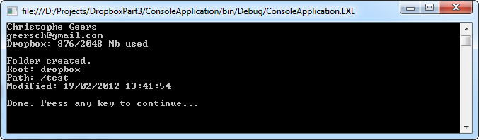

# Dropbox REST API Part 3: Create, Delete and Move Folders

## Introduction

In the previous part [part 2: API Requests](../part-2/README.md) I mentioned that the third part would show you how to perform various folder operations such as creating, deleting and moving folders.

Well it has been a month, so let's get to it. Go to the download page and download the source code of part 2 (Article #63). Unzip and open the solution in Visual Studio. Make sure you modify the API key and secret located in the console application (Program.cs code file). Replace the values with your own application's key and secret.

Ready? Set? OK, let's start with creating folders...

## Create Folder

The Dropbox REST API states that to [create a folder](http://www.dropbox.com/developers/reference/api#fileops-create-folder) you must supply at least two parameters, namely:

1. **root**: The root relative to which the path is specified. Valid values are sandbox and dropbox.
2. **path**: The path to the new folder to create relative to the root

After creating the folder Dropbox returns some metadata about it. As usual this data is JSON-formatted. Let's create a simple class decorated with attributes from the [Json.NET library](http://james.newtonking.com/projects/json-net.aspx) so that we can easily deserialize this data.

```csharp
[JsonObject(MemberSerialization.OptIn)]
public class FileSystemInfo
{
    [JsonProperty(PropertyName = "rev")]
    public string Revision { get; internal set; }

    [JsonProperty(PropertyName = "bytes")]
    public long Bytes { get; internal set; }

    [JsonProperty(PropertyName = "modified")]
    public DateTime Modified { get; internal set; }

    [JsonProperty(PropertyName = "path")]
    public string Path { get; internal set; }

    [JsonProperty(PropertyName = "root")]
    public string Root { get; internal set; }

    //...
}
```

The FileSystemInfo type is very similar to the File type shown in part 2 of this series. I've abbreviated the code here for readability. This type will also be used as the return type of the Move(...) and Delete(...) methods that we'll implement later.

Let's expand the DropboxApi type so that we can create a folder in the following manner:

```csharp
var folder = api.CreateFolder("dropbox", "/test");
```

First you need to specify the root. Valid values are sandbox or dropbox (production). Then you need to specify the folder relative to the root. Subdirectories are allowed.

```csharp
var folder = api.CreateFolder("dropbox", "/test/subdir");
```

The implementation of the CreateFolder(...) method is similar to the API requests we handled in part 2.

```csharp
public FileSystemInfo CreateFolder(string root, string path)
{
    var uri = new Uri(new Uri(DropboxRestApi.BaseUri),
        String.Format("fileops/create_folder?root={0}&path={1}",
        root, UpperCaseUrlEncode(path)));
    var json = GetResponse(uri);
    return ParseJson<FileSystemInfo>(json);
}
```

First we compose the URL to call, e.g.:

[https://api.dropbox.com/1/fileops/create_folder?root=dropbox&path=%2Ftest](https://api.dropbox.com/1/fileops/create_folder?root=dropbox&path=%2Ftest)

Then we retrieve the response (JSON) by calling the GetResponse(...) method (see part 2), which signs the request using OAuth, and deserialize it into a Folder object using the Json.NET library.

You can examine the folder metadata afterwards:

```csharp
var folder = api.CreateFolder("dropbox", "/test");
Console.WriteLine("Folder created.");
Console.WriteLine(String.Format("Root: {0}", folder.Root));
Console.WriteLine(String.Format("Path: {0}", folder.Path));
Console.WriteLine(String.Format("Modified: {0}", folder.Modified));
```

Which outputs:



## URL Encoding

Did you notice that I URL encoded the path parameter in the CreateFolder(...) method? This is necessary in order to send the request. However there is a small issue that we must address.

Let's say we use the [HttpUtility.UrlEncode](http://msdn.microsoft.com/en-us/library/4fkewx0t.aspx)(...) method to URL encode the path.

```csharp
var path = HttpUtility.UrlEncode(path);
```

This will transform the path /test info %2ftest. The slash (/) is translated to %2f. However if you use that value with the Dropbox API you'll get an error informing you that the signature is invalid.

Apparently the Dropbox API doesn't like lowercased escaped paths. Instead of %2f it expects %2F (notifice the upper-casing!). Luckily StackOverflow provided an answer for this problem:

[http://stackoverflow.com/questions/918019/net-urlencode-lowercase-problem](http://stackoverflow.com/questions/918019/net-urlencode-lowercase-problem)

So that's why I've included the (private) UpperCaseUrlEncode(...) method to the DropboxApi type. This method encodes the path and makes sure the escaped parts are correctly cased.

```csharp
private static string UpperCaseUrlEncode(string s)
{
    char[] temp = HttpUtility.UrlEncode(s).ToCharArray();
    for (int i = 0; i < temp.Length - 2; i++)
    {
        if (temp[i] == '%')
        {
            temp[i + 1] = char.ToUpper(temp[i + 1]);
            temp[i + 2] = char.ToUpper(temp[i + 2]);
        }
    }
    return new string(temp);
}
```

## Move Folder

You've already done most of the work by now. We can reuse most of the code to move a folder (or file).

```csharp
folder = api.Move("dropbox", "/test", "/temp");
```

Apart from the URL the implementation is the same as the CreateFolder(...) method.

```csharp
public FileSystemInfo Move(string root, string fromPath, string toPath)
{
    var uri = new Uri(new Uri(DropboxRestApi.BaseUri),
        String.Format("fileops/move?root={0}&from_path={1}&to_path={2}",
        root, UpperCaseUrlEncode(fromPath), UpperCaseUrlEncode(toPath)));
    var json = GetResponse(uri);
    return ParseJson<FileSystemInfo>(json);
}
```

The Move(...) method 3 parameters, namely:

1. **root**: The root. Valid values are sandbox or dropbox.
2. **fromPath**: The file or folder to be copied from relative to the root.
3. **toPath**: The destination path, including the new name for the file or folder, relative to root.

## Delete Folder

Let's clean up after ourselves and delete the folder(s) we created. First we created a folder named "test", then moved it to "temp". So let's delete that one.

```csharp
folder = api.Delete("dropbox", "/temp");
```

Again the implementation of the Delete(...) method is very similar to the CreateFolder(...) and Move(...) methods.

```csharp
public FileSystemInfo Delete(string root, string path)
{
    var uri = new Uri(new Uri(DropboxRestApi.BaseUri),
        String.Format("fileops/delete?root={0}&path={1}",
        root, UpperCaseUrlEncode(path)));
    var json = GetResponse(uri);
    return ParseJson<FileSystemInfo>(json);
}
```

And that is all there is to it! Apart from an issue with the casing of the URL encoding creating, moving and deleting folders is pretty easy with the Dropbox REST API. Note that you can also use the Move(...) and Delete(...) methods with files, not just folders.

For the sake of completeness, here's the entire flow of the client application.

```csharp
// Create a folder
var folder = api.CreateFolder("dropbox", "/test");
Console.WriteLine("Folder created.");
Console.WriteLine(String.Format("Root: {0}", folder.Root));
Console.WriteLine(String.Format("Path: {0}", folder.Path));
Console.WriteLine(String.Format("Modified: {0}", folder.Modified));

// Move a folder
folder = api.Move("dropbox", "/test", "/temp");

// Delete a folder
folder = api.Delete("dropbox", "/temp");
```

Check out the Dropbox REST API documentation if you want to explore it further.

[https://www.dropbox.com/developers/reference/api](https://www.dropbox.com/developers/reference/api)
