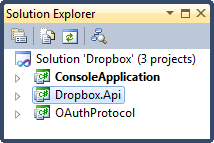

# Dropbox REST API Part 5: File Upload

## Introduction

In the previous part of the [Dropbox series](../part-4/README.md), we handled file downloads. This time I'll show you how you can easily upload files to your Dropbox account.

To follow along, start from the source code of [part #4](../part-4/README.md).



Let's get started...

## URL Encoding

Before we continue, I want to address an issue that was brought to my attention in the comments of the previous parts. A lot of methods of the Dropbox API require that you pass a path parameter which represents the file you want to upload, download, rename...etc. This path parameters needs to be URL encoded correctly.

I use the [HttpUtility.UrlEncode](http://msdn.microsoft.com/en-us/library/4fkewx0t.aspx)(...) method to encode the paths. However as I mentioned in the [3rd part](../part-3/README.md), there is a problem with this method. Slashes (/) are translated to %2f, while Dropbox expects it to be all uppercase. That's why I added the (private) UpperCaseUrlEncode(...) method to the DropboxApi type. It uses the HttpUtility.UrlEncode(...) method to encode the path, but it makes sure the escaped characters are uppercased.

Turns out that .NET’s HttpUtility.UrlEncode(…) does not follow the RFC3986:

[http://www.faqs.org/rfcs/rfc3986.html](http://www.faqs.org/rfcs/rfc3986.html)

For instance, one thing that it does differently is to encode spaces as '+' signs instead of using '%20'.

In PHP they have two functions for this [urlencode](http://www.php.net/manual/en/function.urlencode.php) and [rawurlencode](http://www.php.net/manual/en/function.rawurlencode.php). I could not find a substitue for the rawurlencode method in the .NET framework. So we need to modify the UpperCaseUrlEncode(...) method.

It's not just spaces that caused problems, brackets "(" & ")" were also incorrectly escaped. ( should become %28, and ) should become %29.

Let's fix this to make sure the '+' signs (spaces), bracketes...etc. are correctly encoded.

At the end of the method I compose a dictionary of characters and their percent encoding equivalent. Next I do a "manual" replace of those characters.

```csharp
private static string UpperCaseUrlEncode(string s)
{
    char[] temp = HttpUtility.UrlEncode(s).ToCharArray();
    for (int i = 0; i < temp.Length - 2; i++)
    {
        if (temp[i] == '%')
        {
            temp[i + 1] = char.ToUpper(temp[i + 1]);
            temp[i + 2] = char.ToUpper(temp[i + 2]);
        }
    }

    var values = new Dictionary<string, string>()
    {
        { "+", "%20" },
        { "(", "%28" },
        { ")", "%29" }
    };

    var data = new StringBuilder(new string(temp));
    foreach (string character in values.Keys)
    {
        data.Replace(character, values[character]);
    }
    return data.ToString();
}
```

Now it correctly encodes the spaces and brackets. If any more characters should cause problems you just need to add them to the values dictionary.

Take a look at percent encoding for more information:

[http://en.wikipedia.org/wiki/Percent-encoding](http://en.wikipedia.org/wiki/Percent-encoding)

## Uploading a File

Open the DropboxApi.cs code file (Dropbox.Api project) and add the following method to the DropboxApi type.

```csharp
public FileSystemInfo UploadFile(string root, string path, string file)
{
  //...
}
```

The method has 3 parameters:

- **root**: The root relative to which the path is specified. Valid values are sandbox and dropbox.
- **path**: The path to the file you want to upload.
- **file**: Absolute path to the local file you want to upload

You can call this new method as follows:

```csharp
var file = api.UploadFile("dropbox", "photo.jpg", @"C:\Pictures\photo.jpg");
```

Let's implement the method. First let's compose the URL of the Dropbox API which we'll need to call.

```csharp
var uri = new Uri(new Uri(DropboxRestApi.ApiContentServer),
    String.Format("files_put/{0}/{1}",
    root, UpperCaseUrlEncode(path)));
```

This will give you the following URI:

[https://api-content.dropbox.com/1/files_put/dropbox/photo.jpg](https://api-content.dropbox.com/1/files_put/dropbox/photo.jpg)

Next we need to sign this request using our little OAuth library.

```csharp
var oauth = new OAuth();
var requestUri = oauth.SignRequest(uri,
    _consumerKey, _consumerSecret, _accessToken, "PUT");
```

**Remark**: For file uploads you need to use PUT semantics. You also need to specify this when signing the request. The OAuth code will use GET by default, this will result in an invalid signature and Dropbox will return a 403 Forbidden error. I modified the OAuth code a bit so that you can specify the HTTP method when signing a request. Check out the source code if you want to explore that part further.

Let's create a request.

```csharp
var request = (HttpWebRequest) WebRequest.Create(requestUri);
request.Method = WebRequestMethods.Http.Put;
request.KeepAlive = true;
```

Now for the easy part, let's read the source file into a byte array.

```csharp
byte[] buffer;
using (var fileStream = new FileStream(
    file, FileMode.Open, FileAccess.Read))
{
    int length = (int) fileStream.Length;
    buffer = new byte[length];
    fileStream.Read(buffer, 0, length);
}
```

Now you need to write this byte array to the request stream of the request.

```csharp
request.ContentLength = buffer.Length;
using (var requestStream = request.GetRequestStream())
{
    requestStream.Write(buffer, 0, buffer.Length);
}
```

Voila, the request has been prepared. Time to send it and parse the response. Dropbox returns metadata for the uploaded file. We can deserialize this data (JSON) into our existing FileSystemInfo type.

```csharp
var response = request.GetResponse();
var reader = new StreamReader(response.GetResponseStream());
var json = reader.ReadToEnd();
return ParseJson<FileSystemInfo>(json);
```

See how easy that was? Now you can upload a file using two lines of code.

```csharp
var api = new DropboxApi(ConsumerKey, ConsumerSecret, accessToken);
var file = api.UploadFile("dropbox", "photo.jpg", @"c:\pictures\photo.jpg");
```

Check out the Dropbox REST API documentation if you want to explore it further and implement new features.

[https://www.dropbox.com/developers/reference/api](https://www.dropbox.com/developers/reference/api)

In part 6 I’ll come back to authentication and show you how you can implement a callback mechanism. This way Dropbox lets you know when the user has authorized your application.
