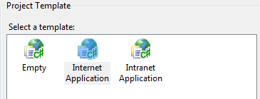
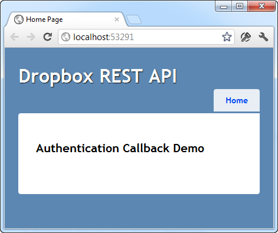
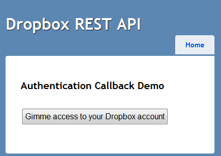

# Dropbox REST API Part 6: OAuth Callback

## Introduction

With this entry into the [Dropbox series](https://github.com/geersch/DropboxRESTApi) we come back to the beginning of the cycle. We started with [authentication](../part-1/README.md) and that's where we'll end.

Having a user authorize your application to access his or hers Dropbox account consists out of 3 steps. Using [OAuth](http://oauth.net/) you must:

1. [Retrieve a request token](../part-1/README.md)
2. [Have the user authorize your application](../part-1/README.md)
3. [Retrieve an access token](../part-1/README.md)

Before retrieving an access token you must wait until the user has authorized your application. There's no way to determine when this has happened. Up until now we just waited a little while and hoped for the best. However, when you instruct the user to authorize your application, you can also specify a callback URL which will automatically be called when the authorization process has been completed.

Let's create a sample web application that demonstrates this.

## MVC 3 Template

Start from the code of part #5 and open it up in Visual Studio. Add a new MVC 3 web application called "MvcApplication" to the solution.


Make sure to select the Internet Application template so that we don't have to create a basic layout ourselves.



The first thing I did was to remove the about page and everything related to the account pages (login, register...etc.). You won't need them. I just want to get a simple one page site up and running as fast as possible. After removing these unnessary pages, user controls, markup...etc. You should wind up with a site resembling the following:



Feel free to adjust the default messages on the page as you please.

## Authorization

Let's kick off the authorization process. Add a reference to the OAuthProtocol and Dropbox.Api projects. Next add a simple form to the home page (Index.cshtml).

```html
@using (Html.BeginForm("AuthorizeDropbox", "Home")) {
<input type="submit" value="Gimme access to your Dropbox account" />
}
```

Which results in this cutting edge form:



When you submit the form the AuthorizeDropbox() action is executed. Let's implement it.

First add your application's key and secret to the HomeController class.

```csharp
private const string ConsumerKey = "your application key";
private const string ConsumerSecret = "your application secret";
```

Then add the following action to the controller.

```csharp
public ActionResult AuthorizeDropbox()
{
    var oauth = new OAuth();
    var requestToken = oauth.GetRequestToken(
        new Uri(DropboxRestApi.BaseUri), ConsumerKey, ConsumerSecret);

    Session["requestToken"] = requestToken;

    var action = Url.Action("Authorized", "Home", null, Request.Url.Scheme);
    var callbackUri = new Uri(action);

    var authorizeUri = oauth.GetAuthorizeUri(
        new Uri(DropboxRestApi.AuthorizeBaseUri), requestToken, callbackUri);

    return Redirect(authorizeUri.ToString());
}
```

First you retrieve a request token and temporarily store it in the session state. Next you compose the callback URL which is automatically called after the user has authorized your application. The callback should resemble something like this:

[http://localhost:53291/Home/Authorized](http://localhost:53291/Home/Authorized)

Last, but not least you retrieve the authorization URL and redirect the user to it so he can start the authorization process. The user will now be redirected to his Dropbox account where he'll have to login and get a chance to authorize your application.

## OAuth

If you compile now you should get some compiler errors. You'll need to modify the OAuth type located in the OAuthProtocol project slightly. Open OAuth.cs code file and add an extra parameter (callbackUrl) to GetAuthorizeUri(...) method.

```csharp
public Uri GetAuthorizeUri(Uri baseUri, OAuthToken requestToken, Uri callbackUrl)
{
    //...
}
```

Now you need to modify the implementation of this method. It's really simple actually. If a callback URL is specified, just append it to the query string.

```csharp
var queryString = String.Format("oauth_token={0}",
    requestToken.Token);
if (callbackUrl != null)
{
    queryString = String.Format("{0}&&oauth_callback={1}",
        queryString, callbackUrl);
}
var authorizeUri = String.Format("{0}{1}?{2}", baseUri,
    "oauth/authorize", queryString);
return new Uri(authorizeUri);
```

And for good measure let's add an overload, so that the existing code (which is not expecting this extra parameter) doesn't break.

```csharp
public Uri GetAuthorizeUri(Uri baseUri, OAuthToken requestToken)
{
    return GetAuthorizeUri(baseUri, requestToken, null);
}
```

## Callback

If you specified a callback URL then the user will be redirected here once he has authorized your application. Dropbox will provide a couple of values via GET parameters in the URL:

- **oauth_token**: The request token that was just authorized.
- **uid**: The user's unique Dropbox ID.

Let's add an action to the home controller so that we can handle the callback.

```csharp
public ActionResult Authorized(string oauth_token, string uid)
{
   //...
}
```

The implementation is straight forward.

```csharp
var requestToken = (OAuthToken) Session["requestToken"];

var oauth = new OAuth();

var accessToken = oauth.GetAccessToken(
    new Uri(DropboxRestApi.BaseUri), ConsumerKey, ConsumerSecret, requestToken);

ViewBag.UserId = uid;
ViewBag.AccessToken = accessToken;

return View();
```

First you need to retrieve the request token / secret from the session state. Then you can retrieve an access token. You need to store this access token somewhere, so that you can use it next time instead of forcing the user to follow the entire authorization process again.

To finish this sample I just display a simple view which lists the access token. But ofcourse, what you do once you've got access to the user's Dropbox account is up to you.
